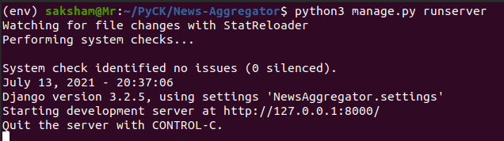

# News-Aggregator
A web application that filters news articles from websites (web scraping) according to a given list of keywords.

## Installation Instructions
Clone this repository in your local system and open the directory using 
`git clone https://github.com/Saksham-Katiyar/News-Aggregator.git` 
`cd New-Aggregator`

Launch the python virtual environment using the command  
`source env/bin/activate`
Or alternatively, you may just install the dependencies using pip  
`python3 -m pip install requests BeautifulSoup4 django`

Run the Django web app server using command  
`python3 manage.py runserver`

You should see something like this in the terminal: 

The web server will be running on `http://127.0.0.1:8000/` as shown in the terminal. Copy the url, paste it in your browser and hit enter. The webpage will look something like this: 

Hit the button "Get news" to update the news. If the page is blank then maybe none of the articles matches with the given keyword list. You can add/subtract/edit words in the list `keywords` in "news/views.py" file.
